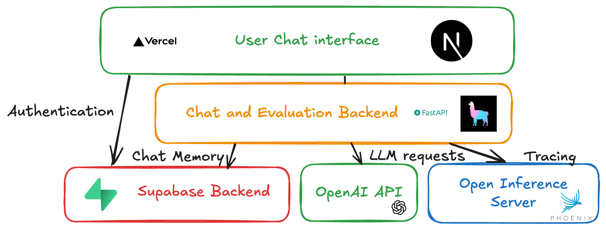

# Overview

I am terrible at organizing my notes and folders in a consistent way. I know I am not alone there, and I see the potential to apply this technology more widely and in the enterprise, but for now I want to focus on getting something useful from the technology with the limited data and a personal use case.
Let's assume we have guidelines on how to organize a file folder.

## Topics covered
- The basics : prompt engineering
- Agentic flow and prompt chaining
- Instrumentation and observability
- Bootstrapping an agentic dataset

# Task

The agent will ultimately help with organization of files. We decided to focus on two specific subtasks : 
1. Organize a set of files according to guidelines. 
2. Migrate a source folder into a target folder, all the while keeping with the guidelines imposed on the target folder. This is a very real use-case for me since I recently tried out Obsidian as a note-taker and would love to migrate my notes from other tools into a unified structure. 

# Approach
In as much as possible I want to focus on having the tools to improve my agent. I chose not to use one of the boutique AI applications as I wanted to add some UI specific to my use-case.

## App architecture
In order to create a Chat UI quickly, I would recommend [create-llama](https://github.com/run-llama/create-llama) which is a great help for a quickstart. It utilises the [Vercel AI SDK](https://sdk.vercel.ai/docs/introduction) which I found helpful to stream Agent responses back. I am utilizing Supabase for authentication and storing chat memory.

The stack for this application is depicted below.

## Observability first

Since our goal is not to focus on Application development, but indeed Agent development, I decided to center this project and blog post around instrumentation and how it can help us refine an agentic application. We are using [Arize's Phoenix](https://phoenix.arize.com/) in order to instrument our application, as it conveniently offers integrations and automatic instrumentations for LLamaIndex and most of the major AI providers.

# Experimentation

Once we got most of the non-AI moving pieces into place, it is time to iterate on our AI workflow and quality.

## All in one agent

This agent uses file and folder structure. It has the following tools at its disposal : 

* get_vault_tree : get the structure of the vault
* suggest_file_operations: suggests a reorganization of files
* apply_file_operations: Apply a reorganization of files

Having a different `suggest_file_operations` and `apply_file_operations` allows us to ask for user confirmation.

## Orchestrator - Suggestor

This agent system consists of two different agents. This allows the suggestion agent to provide better suggestions as its task is limited in scope.
- Improve by including deeper insights into wiki best practices

# Conclusion

It is useful to reuse the agentic tooling out there! I believe that the true value of an agentic application is the fruit of the experimentation process that we have outlined here.

Rather than merely being a prompt-engineering project, to be successful applications built this way have more than one moving piece:
- Agent Workflow (responsibility of each agent)
- Tools
- Context (broader than chat memory and retrieval)

# Appendix

## Technology discussion

### Agentic framework or roll your own?

The following discussion is inspired by the [12 factor agent](https://github.com/humanlayer/12-factor-agents) which advocates for greater control over a range of aspects of agentic applications.

The agentic framework we choose offers workflow management and tool calling.

However it is true that a lot of things essential to the improvement of your agentic application are obfuscated by the framework.

To name only a few, context engineering, memory management, and the instrumentation are things that are done in a very opinionated way by LlamaIndex and might not be the best fit for your application, or even the most intuitive for that matter.

To give a concrete example, I started out building a workflow for the user to progress into, only to realize that every interaction with the user required either exiting (stopping) the workflow or emitting a specific event, which means you always get back to the same point in the workflow. So those workflows are not meant to be user facing.
